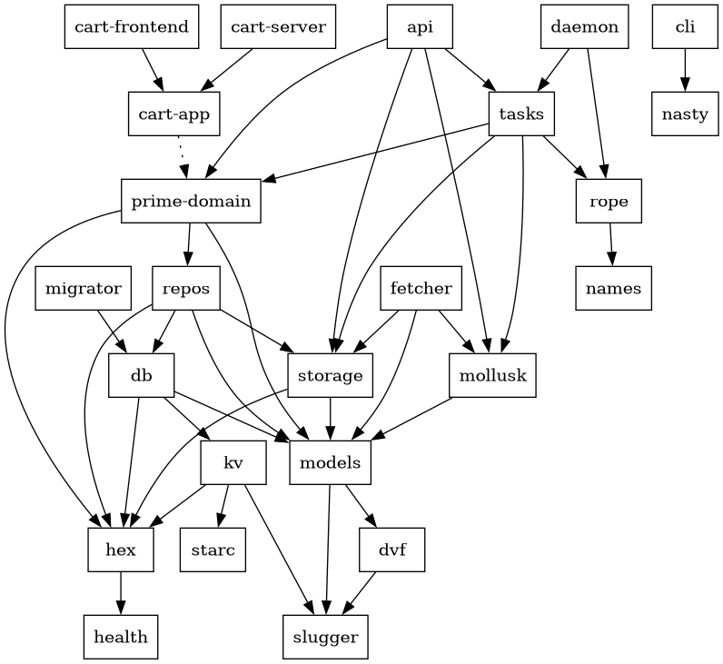

# nika

Welcome to the `nika` monorepo. Feel free to look around.

- See [PROJECTS](./PROJECTS.md) for project goals and objectives.
- See the [ROADMAP](./ROADMAP.md) for (old) project direction and status.

## Development

### Setup

We use [Nix](https://nixos.org/) for dev shells, enabled by [`direnv`](https://direnv.net/).
You should have both of these installed, and you should have the
[flake features](https://nixos.wiki/wiki/flakes) enabled for your Nix installation.

If all is well, enter the project directory and `direnv` should complain about
the `.envrc` being untrusted. Trust it with `direnv allow`, and nix will begin
to build the devshell. When that's complete, you should have a shell with all
the necessary dependencies available. The devshell will also come with custom
commands, which you can explore with the `menu` command.

### Contributing

- Before submitting a PR, run the `check` command (an alias of `nix flake check -L`). This will test many things, and will also be run in CI.

## Crate Map

- `api` (bin) - main action entrypoint over HTTP.
- `art` - macro-based ascii art.
- `cart-app` - cartographer leptos app logic.
- `cart-frontend` - cartographer leptos frontend wrapper.
- `cart-server` (bin) - cartographer leptos server.
- `cli` (bin) - command line interface (mostly useless right now).
- `daemon` (bin) - task runner daemon.
- `db` - model-based database adapter interface, and TiKV implementer.
- `dvf` - usage-specific newtypes used in models.
- `fetcher` (bin) - temporary binary for the fetch pathway.
- `health` - health check framework
- `hex` - foundational hexagonal architecture traits.
- `kv` - key-value store interface and types, and TiKV implementer.
- `migrator` (bin) - database test data migration tool.
- `models` - primary db model types.
- `mollusk` - interfaces for HTTP errors, public and private.
- `names` - name generator.
- `nasty` - nix daemon interactions.
- `prime-domain` - service-level entrypoints for logic in the prime domain.
- `repos` - repository interfaces and implementers.
- `rope` - persistent distributed task interface.
- `slugger` - slug types.
- `starc` - smart pointer for static, owned, or ref-counted data.
- `storage` - storage interface and implementers.
- `tasks` - task types and logic.

## License

This project is licensed under the AGPL-3.0 with an addendum restricting direct competition. 

- See the [LICENSE](./LICENSE) file for the full AGPL text.
- See the [ADDENDUM](./ADDENDUM) file for additional restrictions.

As of this moment, this workspace is not published on [crates.io](https://crates.io) so the cargo license metadata is not populated. This has no bearing on the licensure of the code.

By using this software, you agree to be bound by the terms of the AGPL and the addendum.

